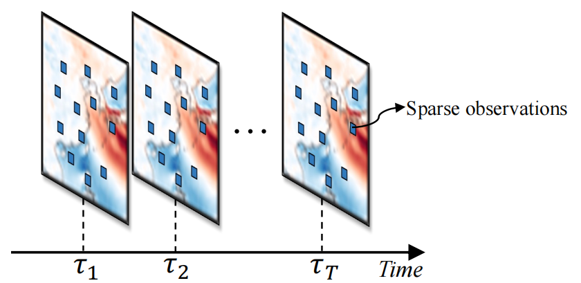
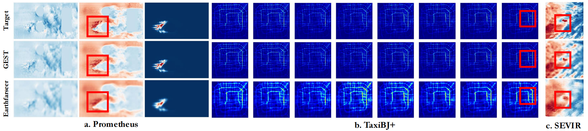

# GEST: Dual Structured Exploration with Graph ODE for Spatio-Temporal Dynamic System Modeling

 <!-- Add actual framework image if available -->

Official implementation of **GEST** - A dual-branch framework integrating graph-based and spectral methods for spatio-temporal dynamic system modeling. Accepted by ICME (Anonymous submission).

[](https://pytorch.org/)
[](LICENSE)

## 📖 Table of Contents
• [Key Features](#-key-features)
• [Installation](#-installation)
• [Dataset Preparation](#-dataset-preparation)
• [Quick Start](#-quick-start)
• [Model Architecture](#-model-architecture)
• [Experimental Results](#-experimental-results)
• [Directory Structure](#-directory-structure)
• [Citation](#-citation)
• [License](#-license)

## 🌟 Key Features
• **Dual-Branch Architecture**: Combines **Attention-enhanced Graph ODE** and **Global Fourier Module**
• **Continuous-Time Modeling**: Neural ODE framework for temporal evolution
• **Spectral Processing**: Fourier-based global dependency capture
• **Multi-Domain Adaptability**: Validated on meteorology, combustion, and fluid dynamics datasets

## ⚙️ Installation
```bash
# Create conda environment
conda create -n gest python=3.8
conda activate gest

# Install dependencies
pip install -r requirements.txt

# Key dependencies
# PyTorch 1.10+
# NumPy 1.22+
# Matplotlib 3.5+
```

## 📂 Dataset Preparation
Supported datasets:
• `SEVIR` (Meteorological radar)
• `Prometheus` (Wildfire simulation)
• `NS2D` (Fluid dynamics)

**Data Structure:**
```bash
data/
├── ns_V1e-4_train.npy
├── ns_V1e-4_test.npy
├── sevir_train.npy
└── sevir_test.npy
```

## 🚀 Quick Start
### Training
```bash
python train.py \
  --dataset sevir \
  --batch_size 32 \
  --epochs 100 \
  --learning_rate 0.001 \
  --data_filepath ./data/
```

### Evaluation
```bash
python evaluate.py \
  --dataset sevir \
  --model_path best_model_sevir.pth \
  --data_filepath ./data/
```

## 🧠 Model Architecture
### Core Components
1. **Graph ODE Module**
   • Spatio-temporal graph construction
   • Continuous-time evolution via Neural ODE
   • Attention-based state initialization

2. **Global Fourier Module**
   • Spectral convolution layers
   • Frequency-domain feature learning
   • Residual connections

 <!-- Add module diagram if available -->

## 📊 Experimental Results
### Performance Comparison (SEVIR Dataset)
| Method       | MSE ↓     | SSIM ↑     | PSNR ↑    |
| ------------ | --------- | ---------- | --------- |
| ConvLSTM     | 48.45     | 0.9782     | 37.72     |
| Earthfarseer | 43.32     | 0.9822     | 39.29     |
| **GEST**     | **42.93** | **0.9876** | **39.42** |

 <!-- Add qualitative results if available -->

## 📂 Directory Structure
```bash
GEST/
├── dataloader/          # Data loading modules
│   ├── ns2d_dataset.py
│   └── sevir_dataset.py
├── model/               # Core model components
│   ├── fourier_module.py
│   ├── graphode_module.py
│   └── main_model.py
├── utils/               # Helper functions
│   ├── data_utils.py
│   └── logger.py
├── train.py             # Training script
├── evaluate.py          # Evaluation script
└── requirements.txt     # Dependency list
```

## 📜 Citation
```bibtex
@inproceedings{gest2024icme,
  title={GEST: Dual Structured Exploration with Graph ODE for Spatio-Temporal Dynamic System Modeling},
  author={Anonymous},
  booktitle={Proceedings of the IEEE International Conference on Multimedia and Expo},
  year={2024},
  note={Under Review}
}
```

## 📃 License
This project is licensed under the Apache License 2.0 - see the [LICENSE](LICENSE) file for details.

---

**Contact**: For technical inquiries, please open a GitHub issue or contact the anonymous submission authors through ICME review system.